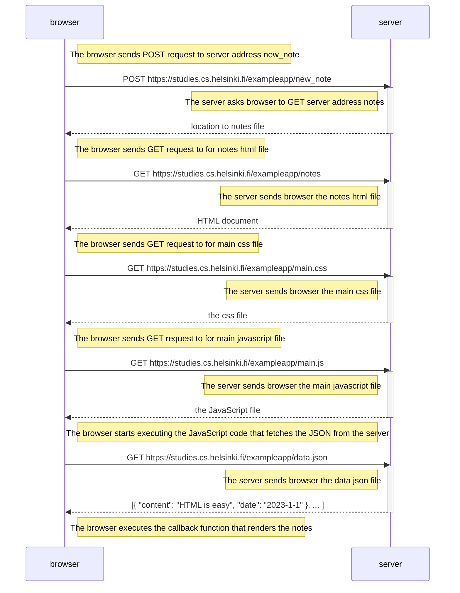

```mermaid

sequenceDiagram;
    participant browser
    participant server

    Note right of browser: The browser sends POST request to server address new_note
    browser->>server: POST https://studies.cs.helsinki.fi/exampleapp/new_note
    activate server
    Note left of server: The server asks browser to GET server address notes
    server-->>browser: location to notes file
    
    deactivate server

    Note right of browser: The browser sends GET request to for notes html file

    browser->>server: GET https://studies.cs.helsinki.fi/exampleapp/notes
    activate server
    Note left of server: The server sends browser the notes html file
    server-->>browser: HTML document
    
    deactivate server

    Note right of browser: The browser sends GET request to for main css file

    browser->>server: GET https://studies.cs.helsinki.fi/exampleapp/main.css
    activate server
    Note left of server: The server sends browser the main css file
    server-->>browser: the css file
    deactivate server

    Note right of browser: The browser sends GET request to for main javascript file

    browser->>server: GET https://studies.cs.helsinki.fi/exampleapp/main.js
    activate server
    Note left of server: The server sends browser the main javascript file
    server-->>browser: the JavaScript file
    deactivate server

    Note right of browser: The browser starts executing the JavaScript code that fetches the JSON from the server

    browser->>server: GET https://studies.cs.helsinki.fi/exampleapp/data.json
    activate server
    Note left of server: The server sends browser the data json file
    server-->>browser: [{ "content": "HTML is easy", "date": "2023-1-1" }, ... ]
    deactivate server

    Note right of browser: The browser executes the callback function that renders the notes
```
