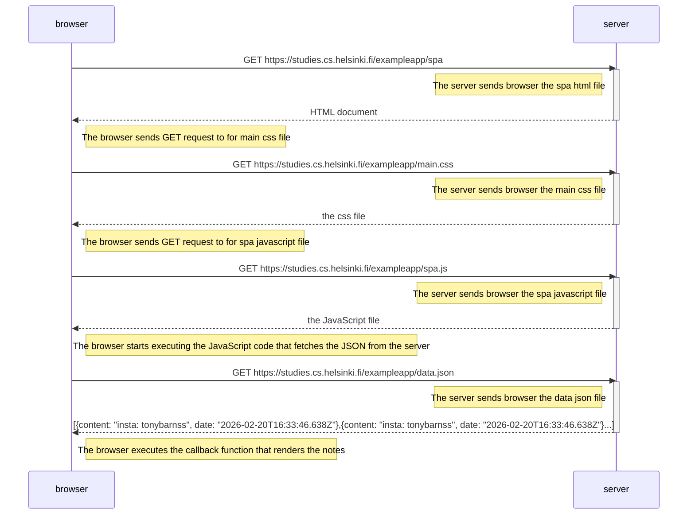

```mermaid

sequenceDiagram
    participant browser
    participant server
    
    browser->>server: GET https://studies.cs.helsinki.fi/exampleapp/spa
    activate server
    Note left of server: The server sends browser the spa html file
    server-->>browser: HTML document
    
    deactivate server

    Note right of browser: The browser sends GET request to for main css file

    browser->>server: GET https://studies.cs.helsinki.fi/exampleapp/main.css
    activate server
    Note left of server: The server sends browser the main css file
    server-->>browser: the css file
    deactivate server

    Note right of browser: The browser sends GET request to for spa javascript file

    browser->>server: GET https://studies.cs.helsinki.fi/exampleapp/spa.js
    activate server
    Note left of server: The server sends browser the spa javascript file
    server-->>browser: the JavaScript file
    deactivate server

    Note right of browser: The browser starts executing the JavaScript code that fetches the JSON from the server

    browser->>server: GET https://studies.cs.helsinki.fi/exampleapp/data.json
    activate server
    Note left of server: The server sends browser the data json file
    server-->>browser: [{content: "insta: tonybarnss", date: "2026-02-20T16:33:46.638Z"},{content: "insta: tonybarnss", date: "2026-02-20T16:33:46.638Z"}...]
    deactivate server

    Note right of browser: The browser executes the callback function that renders the notes

```

