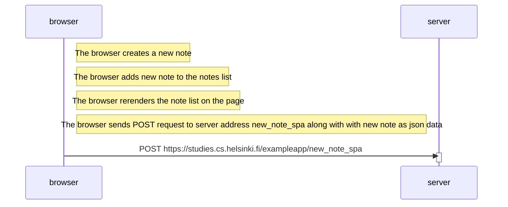

```mermaid

sequenceDiagram;
    participant browser
    participant server

    Note right of browser: The browser creates a new note
    Note right of browser: The browser adds new note to the notes list
    Note right of browser: The browser rerenders the note list on the page
    Note right of browser: The browser sends POST request to server address new_note_spa along with with new note as json data
    browser->>server: POST https://studies.cs.helsinki.fi/exampleapp/new_note_spa
    activate server
    
    deactivate server
```
